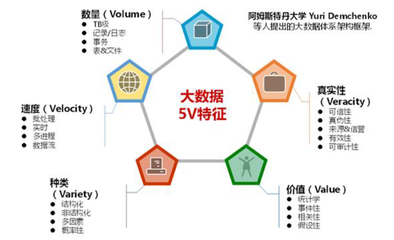
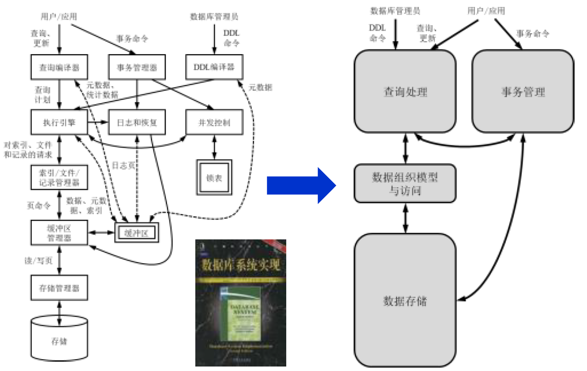
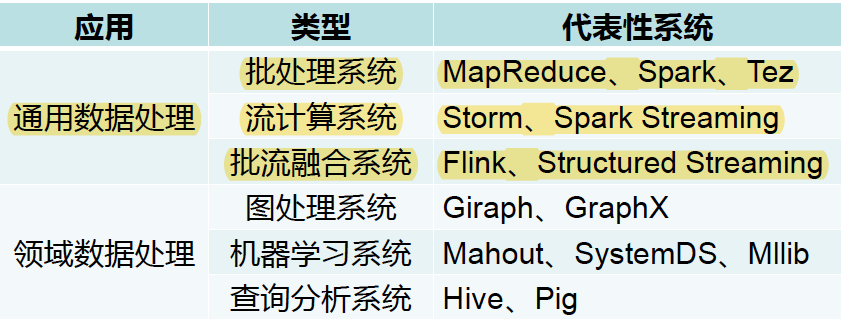

# Chapter1 绪论

**1.简述分布式系统概念**

 《分布式系统：概念与设计》认为：分布式系统是若干独立计算机的集合，这些计算机对于用户来说就像是一个单机的系统。

**2.分布式系统可以分为哪些类型**

- 分布式计算系统（基于计算机构建）
  - 集群计算：局域网
  - 网格计算：公网
  - 云计算
- 分布式信息系统（基于计算机构建）
  - 事务处理
  - 企业信息集成
- 基于微性设备构建的系统
  - 智慧家庭
  - 电子健康
  - 传感网络

**3.简述数据管理系统的发展历史**

1. 层次、网状数据库：数据的存储与访问从应用程序中分离
2. 关系数据库：OLTP
3. 数据仓库系统：OLAP
4. 大数据管理系统：分布式、可扩展、高可用

大数据背景下，数据管理系统的设计理念从"One size fits all"转向分类定制

**4.简述大数据的特征**

**5.数据库系统有哪些主要的功能模块**

**6.数据密集型应用和计算密集型应用何区别**

计算密集型应用：计算机在处理这些应用时CPU的处理能力成为了首要限制性因素（如高性能计算领域的数值运算/人工智能领域的深度学习模型训练）

数据密集型应用：计算机在处理这些应用时I/O带宽（包括磁盘I/O、网络I/O等）成为了首要限制性因素

**7.通用数据处理系统可以分为哪些类别？它们分别适用于什么样的场景**

批处理系统：主要用于处理静态数据，吞吐量要求较高而实时性要求相对较低的场景

流处理系统：主要用于处理实时数据，实时性要求较高而吞吐量要求相对较低的场景

批流融合系统：可用于上述两类场景，也适用于同一场景不同模块数据特征和计算需求不同的场景

**8.分布式计算系统本身并无数据存储功能，那么它的输入数据从何而来，并且输出结果又走向何方**

HDFS
