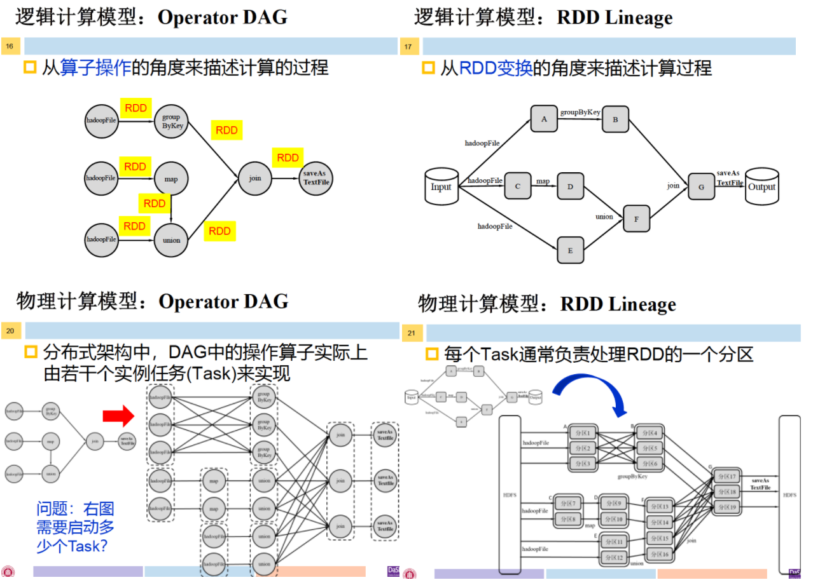
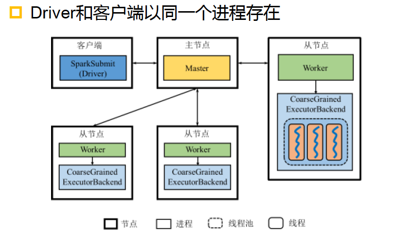
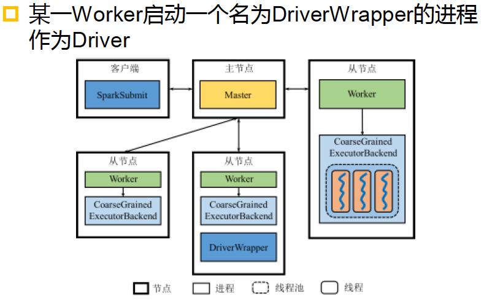

# Chapter4 Spark

**1.与Spark相比，MapReduce有哪些局限性**

1. 编程框架的表达能力有限，用户编程复杂。MapReduce仅提供map和reduce两个编程算子，用户需要基于这两个算子实现数据处理的操作，如join、sort等常用算子，都需要用map和reduce来实现，这增加了编程难度
2. 单个作业的Shuffle阶段的数据以阻塞方式传输，磁盘IO的开销大、延迟高。单个作业的Shuffle阶段，Map端需要将计算结果写入本地磁盘，之后Reduce端才可以读取该计算结果。因此，Shuffle阶段磁盘IO开销大，并且这种阻塞式数据传输方式加剧了MapReduce作业的高延迟
3. 多个作业之间衔接涉及IO开销，应用程序的延迟高。对于单个MapReduce作业来说，通常从HDFS等存储系统读入输入文件，作业执行完的结果输出到HDFS等存储系统。然而，很多应用程序需要通过多个作业来完成，如机器学习的迭代训练过程。迭代计算的中间结果反复读写，使整个应用的延迟非常高

**2.请说明Spark的逻辑计算模型和物理计算模型之间的关系（区别与联系）**

逻辑计算模型：理论教材图4.2，图4.3

物理执行角度：理论教材图4.4，图4.5

逻辑执行图描绘了算子之间的数据流动关系，物理执行图是从逻辑执行图过来的，逻辑执行图上的一个算子在物理执行图上会有多个并行实例

**3.什么是RDD Lineage？如果Lineage较长，如何加快故障恢复？**

1. RDD Lineage是Driver中SparkContext维护的记录RDD转换的DAG，RDD Lineage记录的是粗颗粒度的特点数据Transformation操作。若出现故障，可以利用RDD Lineage重新计算丢失分区进行故障恢复
2. 如果RDD Lineage较长，或者RDD Lineage中存在大量的宽依赖，恢复过程的代价较高。引入检查点机制将RDD写入外部可靠的（本身具有容错机制）分布式文件系统，例如HDFS（在实现层面，写检查点的过程是一个独立的作业，在用户作业结束后运行）

**4.请简述Standalone Clinet与Standalone Cluster两种模式下Spark架构之间的区别，并画出两种模式下的架构图**

区别：

1. Standalone Client模式下，Driver和Client以同一个进程存在
2. Standalone Cluster模式下，Driver为某一个Worker启动的一个名为DriverWrapper的进程

Standalone Client模式

Standalone Cluster模式

**5.Spark如何划分DAG中的Stage？**

一个DAG由多个Stage组成，DAG Scheduler通过分析各个RDD中的分区之间的依赖关系来决定如何划分Stage。简单来说，DAG Scheduler针对DAG做反向解析，遇到宽依赖则生成新的Stage，遇到窄依赖就把该Operator加入到当前Stage中，从而使得窄依赖尽量被划分在同一个Stage中。因此，Stage内部生成的RDD之间是窄依赖关系，而Stage输出RDD和下一Stage输入RDD之间是宽依赖关系。也就是说，只有Stage之间的数据传输需要Shuffle。

**6.Spark中的应用和作业是何种关系**

应用=Application；作业=Job

从逻辑角度看：一个Application由一个或多个DAG组成，一个DAG对应物理执行角度为一个Job

从物理执行角度看：一个Application等于一个或多个Job

**7.Spark中Stage和Task有怎样的联系？**

一个Job会分为多组Task，每组Task被称为Stage，或者也被称为TaskSet，Stage是Job的基本调度单位。

Stage代表了一组关联的、相互之间没有Shuffle依赖关系的Task组成的TaskSet

（Task指运行在Executor上的工作单元）

**8.Spark中Stage内部如何进行数据交换？Stage之间如何进行数据交换？**

Stage内部数据交换：Spark采用流水线（Pipeline）方式进行Stage内部的数据交换

Stage之间数据交换：Spark在Stage之间数据交换时需要Shuffle，Shuffle可能发生在两个ShuffleMapStage之间，或者ShuffleMapStage和ResultStage之间，简化Shuffle过程为Shuffle Write和Shuffle Read两个阶段

- Shuffle Read阶段：ShuffleMapTask或者ResultTask根据partition函数读取相应的ShuffleblockFile，存入缓存区并继续进行后续的计算。
- Shuffle Write阶段：ShuffleMapTask将输出RDD的记录按照分区函数划分道相应的bucket中，物化到本地磁盘形成ShuffleblockFile（之后才能被Shuffle Read阶段拉取）

**9.Spark中RDD持久化和检查点机制有哪些异同点？**（比如说：lineage是否保留？两者的生命周期？）

相同之处：

1. RDD持久化和设置检查点机制都可以为Spark提供容错

不同之处：

1. RDD持久化在是在Spark**内部**某些节点存储多个备份，而检查点机制将RDD写入**外部可靠**的（本身具有容错机制）分布式文件系统，例如HDFS
2. RDD持久化可以加快计算速度，并且作为备份快速恢复因故障丢失的数据分区，而检查点机制仅服务于Spark的故障恢复（减少恢复过程的代价）
3. RDD的持久化发生在计算过程中，而写检查点操作是系统在作业结束之后启动一个独立的作业进行的。
4. 二者的生命周期不同，持久化的RDD会在程序结束后会被清除，而检查点在程序结束后依然存在，不会被删除
5. 持久化的RDD会保留RDD Lineage，但使用检查点机制会失去RDD Lineage

**10.Spark的广播变量机制通常用于什么场景？**（功能像MapReduce的分布式缓存）

适用于需要节约内存的场景，如小表和大表自然连接（部门表join雇员表）

大表的Shuffle开销大，把小表广播出去可以避免大表进行Shuffle
