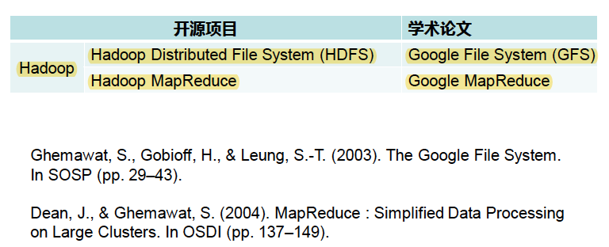
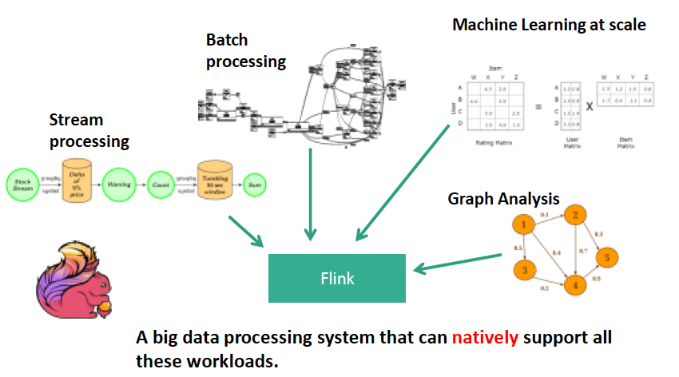

# Overview

## Hadoop文件系统

HDFS是Hadoop项目的一部分，项目发起者是Doug Cutting，最初Hadoop只是Hadoop Lucene的子项目Nutch（文本搜索库）的一部分。2003年和2004年，Google先后发表了GFS和MapReduce两篇论文，Doug Cutting认为GFS和MapReduce不仅可以解决超大规模的网页存储和分析处理问题，而且是一个通用处理技术。因此Doug Cutting根据GFS和MapReduce的思想创建了Hadoop项目，并从Lucene项目中独立出来。

## 批处理系统MapReduce

通常所说的MapReduce一般是指Hadoop项目中的MapReduce，它是Google发表学术论文的一种开源实现，而Google公司内部使用的MapReduce系统并不是开源Hadoop项目中的MapReduce。

MapReduce用于处理大批量静态数据，MapReduce被纳入批处理系统范畴。

## 批处理系统Spark

Spark最初的目标是基于内存的大数据批处理系统，用于构建大型的、低延迟的数据分析应用程序，2009年由UC Berkeley的AMP实验室（AMP实验室的教授联合创建了Databricks公司）开发，Spark在2010年正式开源，并于2014年成为了Apache基金会顶级项目。随着应用需求的变化和技术本身的发展，Spark从最初的仅使用内存的批处理系统，转变为内外存同时使用的批处理系统。并增加了Spark Streaming支持实时流计算，以及Structured Streaming支持批流融合

## 资源管理系统Yarn

Yarn最初是为MapReduce设计的一种资源管理器，后成为通用的资源管理系统，为上层应用提供统一的资源管理和调度。Yarn的引入为集群在利用率、资源统一管理和数据共享方面带来了好处。2012年8月，Yarn成为了Apache Hadoop的一个子项目。

我们认为：引入Yarn之前的MapReduce为第一代MapReduce，引入Yarn之后的MapReduce为第二代MapReduce，第一代MapReduce存在局限性，其中最为显著的是资源管理和作业紧密耦合。Yarn的出现使得资源管理模块从第一代MapReduce中独立出来，成为一个通用资源管理平台，而MapReduce和Spark等则作为运行于该平台之上的框架。

## 批流融合系统Flink

Flink的前身的是Stratosphere项目。2014年Stratosphere成为Apche孵化项目并更名为Flink，此时德国联邦教育研究部进一步资助柏林大数据中心重大项目，Flink成为Apache顶级项目。

起初，Stratosphere是一个批处理系统，后扩充了MapReduce算子，并以流水线方式实现算子间的数据传输，正式由于这一设计，为后来Flink系统支持刘计算奠定了基础。2015年，Google发表Dataflow模型的论文后，Flink逐步定位为批流一体化的执行引擎并支持Dataflow模型中定义的批流融合操作。

